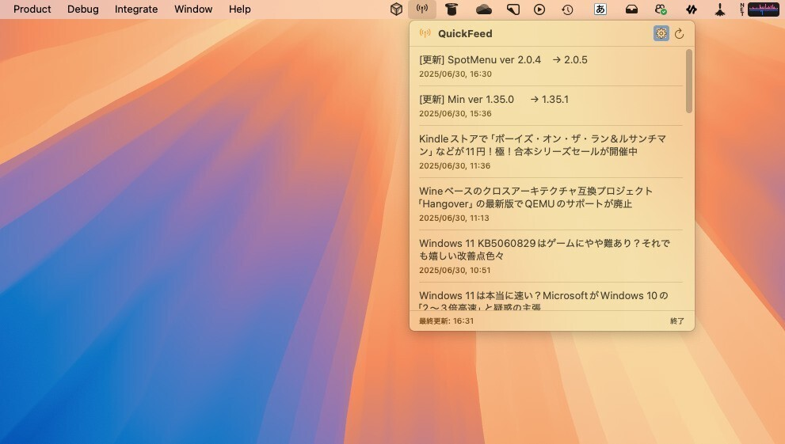

# QuickFeed

macOS用のSwiftUIで開発されたメニューバー常駐型RSSリーダーアプリです。



## 特徴

- **🖥️ メニューバー常駐**: ステータスバーに常駐し、いつでもアクセス可能
- **📰 RSS フィード読み込み**: 指定したURLからRSSフィードを取得
- **🔄 自動更新**: 10分間隔でフィードを自動的に更新
- **🌐 ブラウザ連携**: 記事タイトルをクリックするとデフォルトブラウザで開く
- **⚙️ 設定機能**: フィードURLの変更とカスタマイズ

## 技術仕様

- **プラットフォーム**: macOS 15.4+
- **フレームワーク**: SwiftUI
- **言語**: Swift 5.0
- **アーキテクチャ**: MVVM パターン
- **データ永続化**: UserDefaults

## 主要機能

### 基本機能
- `MenuBarExtra` を使用したメニューバー常駐
- RSSフィードの定期取得・パース
- 記事タイトルの一覧表示
- 記事URLのブラウザ起動

### 設定機能
- RSSフィードURLの変更
- 設定画面でのURL管理

## インストール

1. リポジトリをクローン
```bash
git clone https://github.com/your-username/QuickFeed.git
cd QuickFeed
```

2. Xcodeでプロジェクトを開く
```bash
open QuickFeed.xcodeproj
```

3. ビルド・実行
- Xcodeでプロジェクトをビルド
- アプリを実行するとメニューバーにアイコンが表示されます

## 使用方法

1. アプリを起動すると、メニューバーにアンテナアイコンが表示されます
2. アイコンをクリックすると、RSSフィードの記事一覧が表示されます
3. 記事タイトルをクリックすると、ブラウザで記事が開きます
4. 設定ボタンから、RSSフィードのURLを変更できます

## 開発環境

- Xcode 16.3+
- Swift 5.0
- macOS 15.4+

## プロジェクト構造

```
QuickFeed/
├── QuickFeed/
│   ├── QuickFeedApp.swift      # アプリのエントリーポイント
│   ├── ContentView.swift       # メインビュー
│   ├── MenuView.swift          # メニューバーのビュー
│   ├── SettingsView.swift      # 設定画面
│   ├── RSSFeedManager.swift    # RSSフィード管理
│   ├── RSSParser.swift         # XMLパーサー
│   └── RSSItem.swift           # データモデル
├── QuickFeedTests/             # ユニットテスト
├── QuickFeedUITests/           # UIテスト
└── README.md
```

## 開発について

このアプリは主に[Claude Code](https://claude.ai/code)を使用して開発されました。Claude Codeは効率的なSwiftUIアプリケーション開発を支援し、コード生成からデバッグまでの開発プロセス全体をサポートしています。

## テスト

```bash
# ユニットテストの実行
xcodebuild test -scheme QuickFeed -destination 'platform=macOS'

# UIテストの実行
xcodebuild test -scheme QuickFeed -destination 'platform=macOS' -only-testing:QuickFeedUITests
```

## 貢献

1. フォークしてください
2. フィーチャーブランチを作成してください (`git checkout -b feature/amazing-feature`)
3. 変更をコミットしてください (`git commit -m 'Add some amazing feature'`)
4. ブランチをプッシュしてください (`git push origin feature/amazing-feature`)
5. プルリクエストを開いてください

## ライセンス

このプロジェクトはMITライセンスの下で公開されています。詳細は [LICENSE](LICENSE) ファイルを参照してください。

## 作者

src@srcw.net

## 謝辞

- アイコンは SF Symbols を使用
- デフォルトのRSSフィード提供元: [SoftAntenna](https://softantenna.com/)
- 開発支援: [Claude Code](https://claude.ai/code)